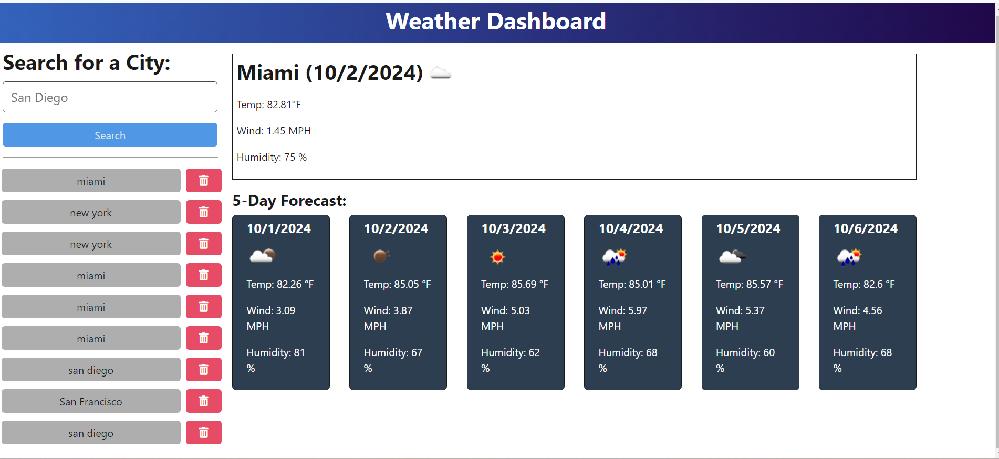

# WeatherTrackerApp

This repository contains a Weather Tracker App that can be deployed in the terminal below.

The following languages were used: JavaScript, TypeScript, HTML & CSS.

# How To Use Weather Tracker

Run in the terminal:

npm run start 

You will be taken to http://localhost:3001/?

# Render Deployed Link

https://weathertrackerapp.onrender.com

# Image Example Below 

